# weblium-test-assignment
Test assignment for a Trainee QA position – website created with Weblium Editor
# Weblium Trainee QA – Test Assignment

This repository contains the result of a practical test assignment completed for a **Trainee QA position**.

## About the Project

The task was to create a multi-page website in **Weblium** according to the provided requirements.

The assignment included not only creating the visual structure of the website, but also configuring and checking the functionality of interactive elements.

Implemented functionality includes:

* page navigation;
* buttons and links;
* storefront;
* store categories and subcategories;
* individual product pages;
* product options;
* contact forms;
* form fields;
* pop-up windows;
* blog feed;
* individual blog posts;
* gallery elements.

## Live Website

🔗 https://rl5vo.weblium.site/

> **Note:** The website was created using the Weblium website builder. The live version may become unavailable in the future because continued publication may require a paid Weblium plan. Screenshots of the implemented pages are included in this repository as a permanent demonstration of the completed assignment.

## Functionality Demo

🎥 [Watch the website functionality demo](https://app.screencast.com/zSNOMquqT9G04?conversation=QoHeBvmu2UWjeojnC6ELNq)

The video demonstrates the implemented functionality, including navigation, buttons, forms, pop-ups, product options, store categories, and other interactive elements.

## Screenshots

### Homepage

### Storefront

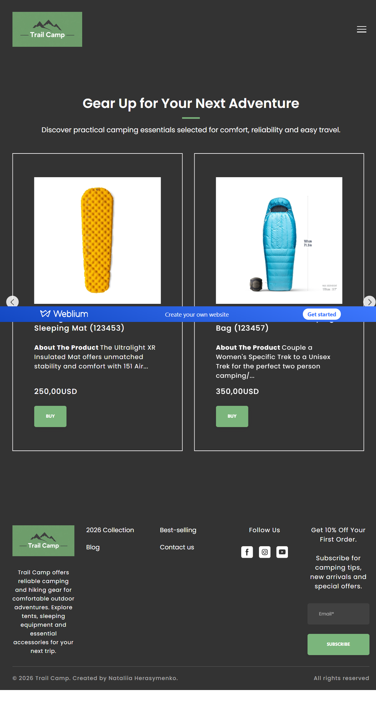

### Store Categories

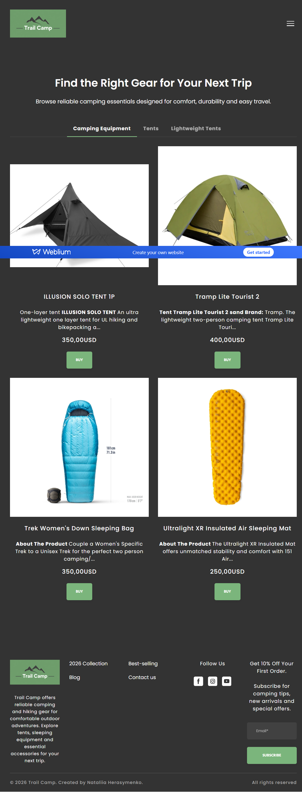

### Single Product

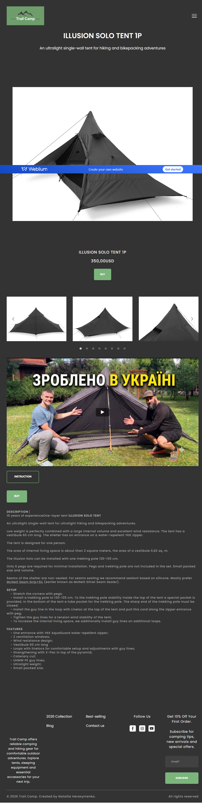

### Product Options

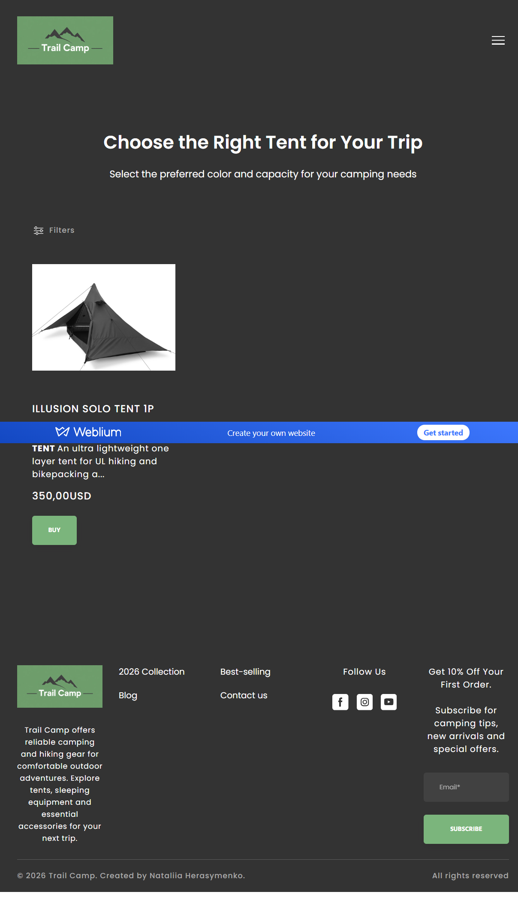

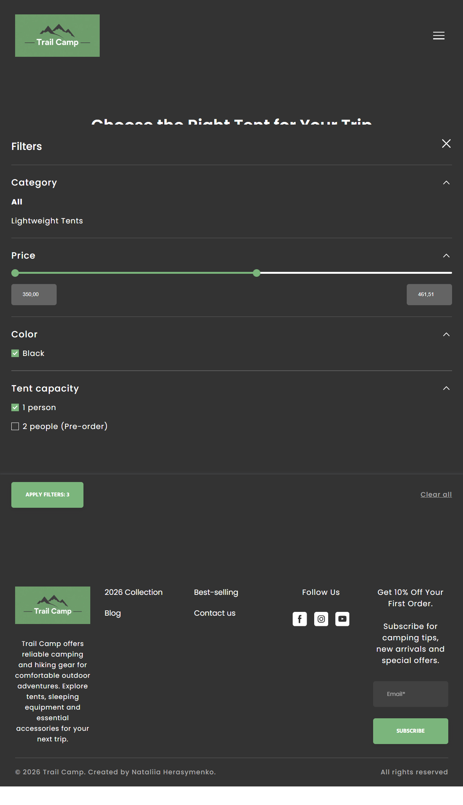

### Blog Feed

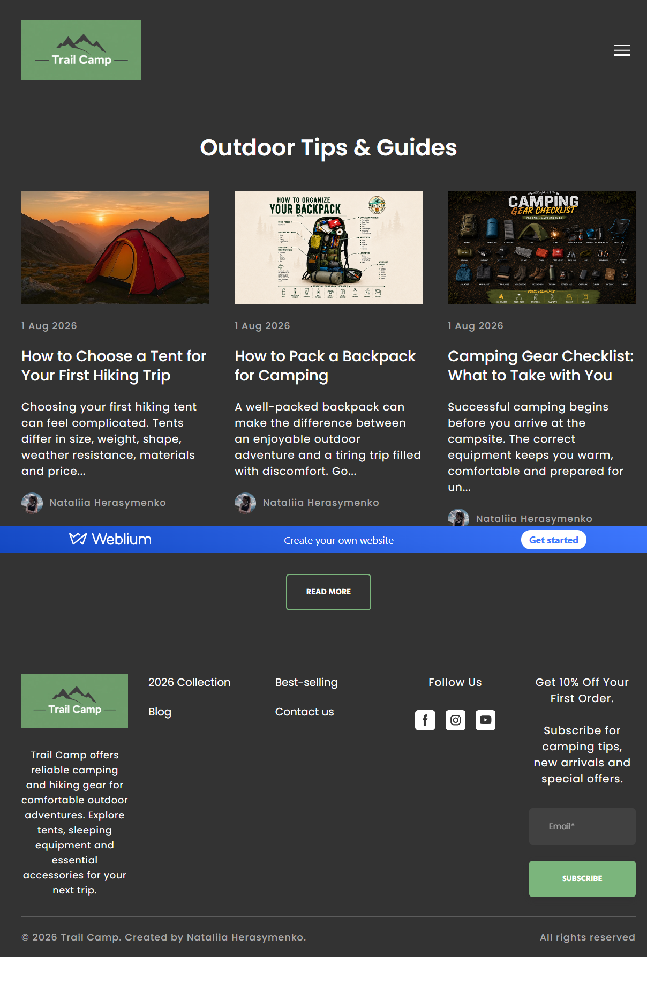

### Blog Post

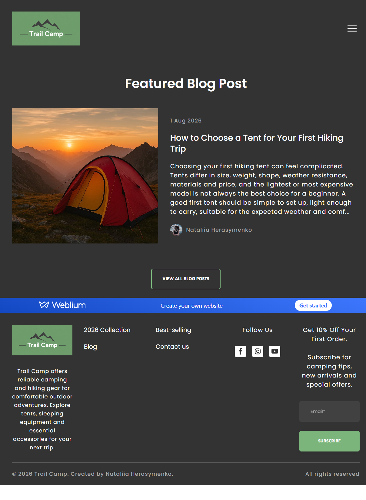

### Contacts

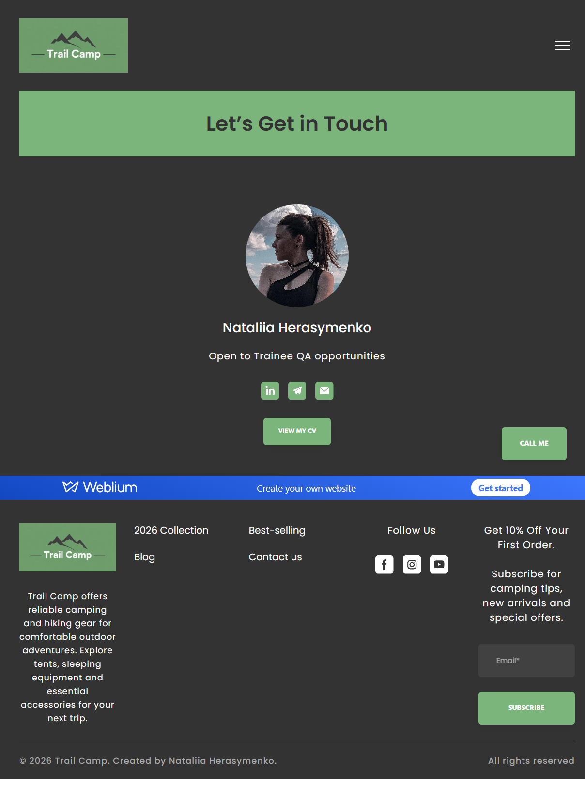

### Contact Forms

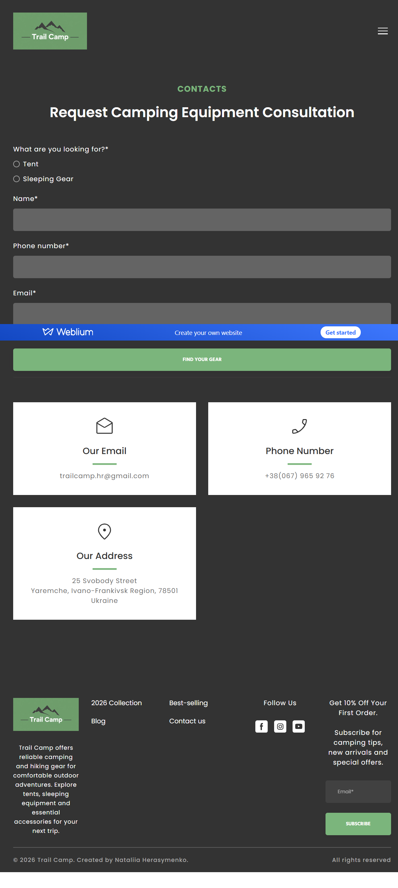

### Gallery

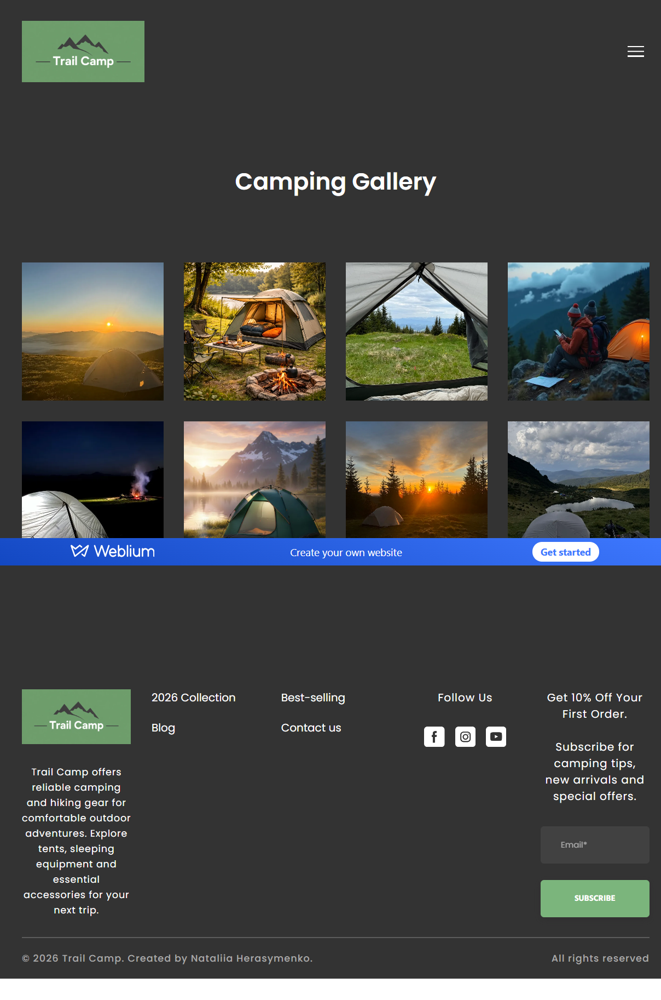

### Pop-ups

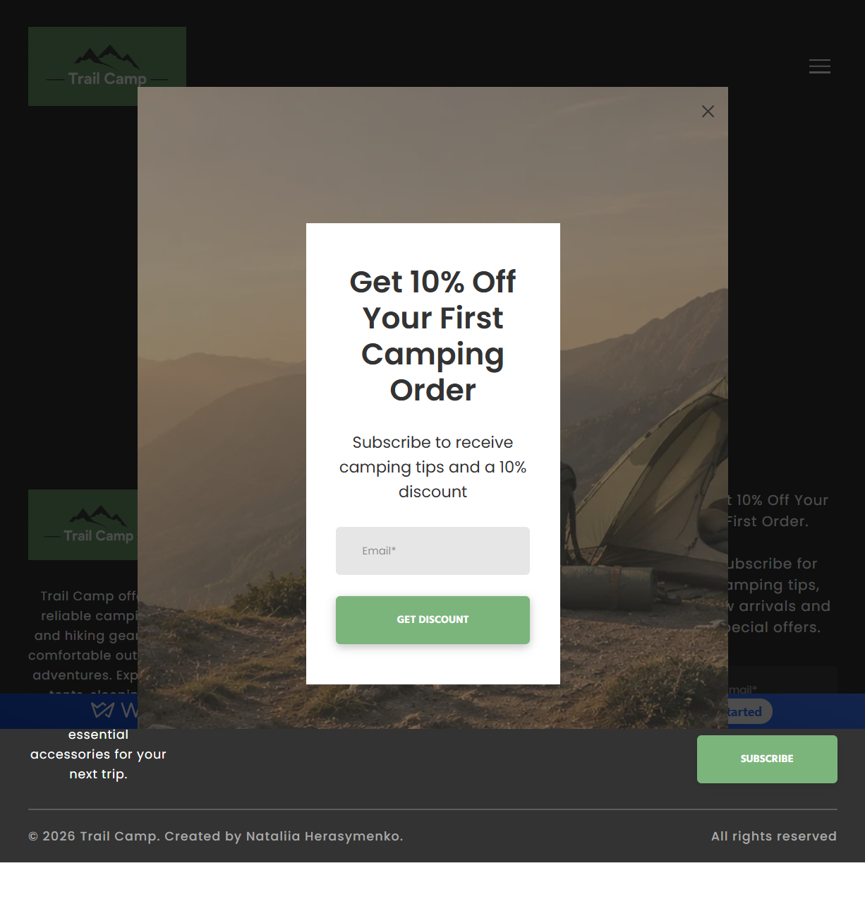

## Tools Used

* Weblium Website Builder
* Chrome DevTools
* GitHub
* Screencast

## Skills Demonstrated

* Working with requirements
* Creating and configuring website functionality
* Verifying navigation and interactive elements
* Working with forms and product options
* Understanding basic website structure
* Checking functional and UI behavior
* Documenting completed work
